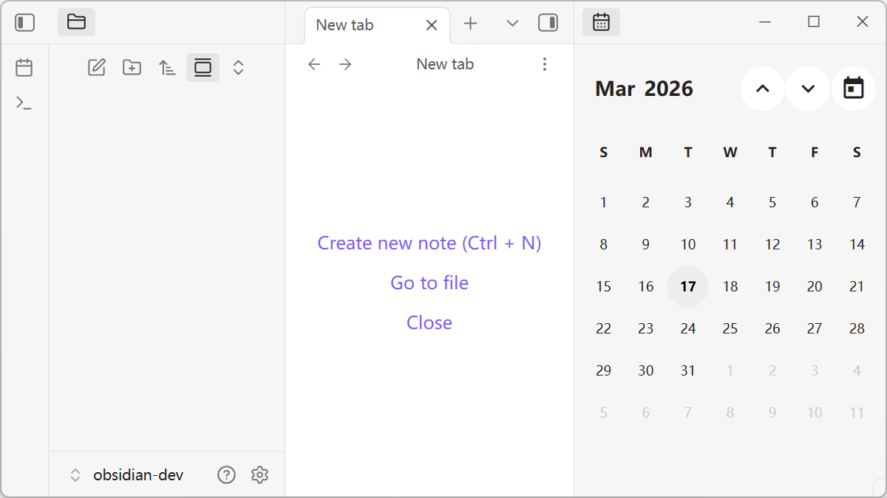
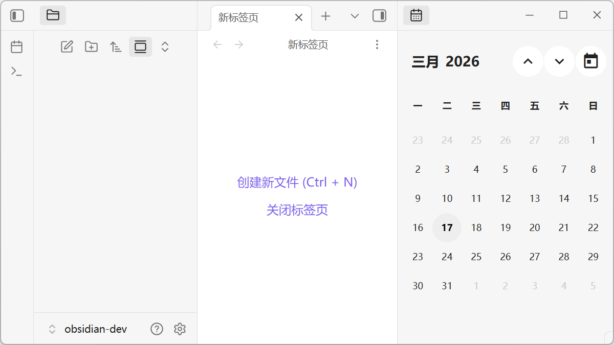

# Obsidian Plugin: Just Calendar

> → English (en) | [中文](https://github.com/aidistan/obsidian-just-calendar#obsidian-%E6%8F%92%E4%BB%B6just-calendar)

Just a calendar which works with the "daily notes" core plugin.

## Features

- Bidirectional linkage: Sync between calendar and daily notes.
- Quick jump: Easily navigate between years and months.
- Keyboard support: Fully operable via keyboard shortcuts.
- Scroll navigation: Support for page turning using the mouse wheel.

## Installation

### From Obsidian Community Plugins (Recommended)

1. Open Obsidian settings.
2. Navigate to **Community plugins** -> **Explore**.
3. Search for "Just Calendar".
4. Click **Install**, then **Enable**.

### Manual Installation

1. Download the latest release (`main.js`, `manifest.json`, `styles.css`) from the [GitHub Releases](https://github.com/aidistan/obsidian-just-calendar/releases).
2. Create a folder named `just-calendar` in your vault's plugin folder: `<vault>/.obsidian/plugins/just-calendar/`.
3. Copy the downloaded files into that folder.
4. Open Obsidian, go to **Settings** -> **Community plugins**, and enable **Just Calendar**.

### Building from Source

1. Clone this repository.
2. Install dependencies by running `pnpm install`.
3. Build the plugin by running `pnpm run build`.
4. Copy `main.js`, `manifest.json`, and `styles.css` to `<vault>/.obsidian/plugins/just-calendar/`.

## Usage

1. **Open Calendar View**:
   - Open the Command Palette (`Ctrl/Cmd + P`), search for `Just Calendar: Open calendar view` and press Enter.
   - Or configure a hotkey for it in Settings.
2. **Create/Open Daily Notes**: Click on any date on the calendar. If the daily note for that day doesn't exist, you will be prompted to create one.
3. **Navigate**: Use keyboard arrows or the mouse scroll wheel to change months or years.

## Acknowledges

- CalendarJS: https://calendarjs.com/

---

# Obsidian 插件：Just Calendar

> → 中文文档 (zh) | [En](https://github.com/aidistan/obsidian-just-calendar#obsidian-plugin-just-calendar)

一个配合“日记”核心插件使用的简单日历，仅此而已。

## 特点

- "日历-日记"双向联动
- 年/月快速跳转
- 支持键盘操作
- 支持滚轮翻页

## 安装

### 插件市场（推荐）

1. 打开 Obsidian 设置。
2. 导航至 **第三方插件** (Community plugins) -> **浏览** (Explore)。
3. 搜索 "Just Calendar"。
4. 点击 **安装** (Install)，然后点击 **启用** (Enable)。

### 手动安装

1. 从 [GitHub Releases](https://github.com/aidistan/obsidian-just-calendar/releases) 下载最新版本的发布文件（包括 `main.js`、`manifest.json`、`styles.css`）。
2. 在您的保管库插件目录中创建文件夹 `just-calendar`：`<vault>/.obsidian/plugins/just-calendar/`。
3. 将下载的文件复制到该文件夹中。
4. 打开 Obsidian，进入 **设置** -> **第三方插件**，然后启用 **Just Calendar**。

### 源码构建

1. 克隆该仓库。
2. 运行 `pnpm install` 安装依赖。
3. 运行 `pnpm run build` 进行构建。
4. 将 `main.js`、`manifest.json` 和 `styles.css` 复制到 `<vault>/.obsidian/plugins/just-calendar/`。

## 使用

1. **打开日历视图**：
   - 打开命令面板（快捷键 `Ctrl/Cmd + P`），搜索 `Just Calendar: 打开日历视图` 并回车。
   - 或者在设置中为此命令配置快捷键。
2. **创建/打开日记**：点击日历上的任何日期。如果当天的日记不存在，系统会提示您是否创建。
3. **导航**：使用键盘方向键或鼠标滚轮进行翻页（切换月份和年份）。

## 致谢

- CalendarJS: https://calendarjs.com/
